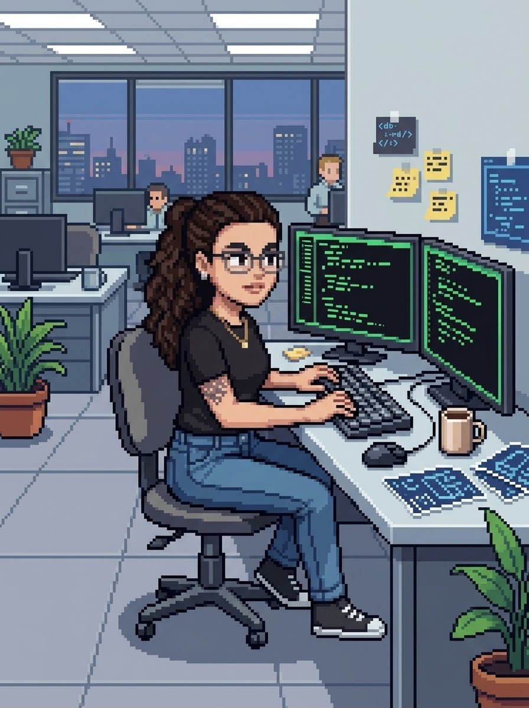

# Olá, eu sou a Júlia

  

###
Sou interessada em **tecnologia, educação e desenvolvimento de projetos**, especialmente na integração entre software, hardware e soluções práticas.

---

## Sobre mim

* Graduanda de Engenharia de Computação - UFG
* Interessada em desenvolvimento e tecnologia
* Atuação com projetos educacionais
* Interesse em automação e sistemas embarcados
* Trabalho com organização e análise de dados
* Explorando aplicações de Inteligência Artificial

---

## Atualmente trabalhando em

* Sistemas embarcados e integração com sensores e displays
* Ferramentas e soluções voltadas para educação
* Automação de tarefas utilizando Inteligência Artificial
* Organização, processamento e análise de dados

---

## Atualmente aprendendo sobre

* Linux
* Machine Learning
* Game Development

---

## Ferramentas e tecnologias

### Linguagens

  
  
  
  
  
  
  
  
  

### Tecnologias

  
  
  
  
  
  
  
  
  
  
  
  
  
  
  
  

### Desenvolvimento

  
  
  
  
  
  
  
  
  
  
  

---

## GitHub

<picture data-importer="pacman">
  <source media="(prefers-color-scheme: dark)" srcset="https://raw.githubusercontent.com/franco-julia/franco-julia/pacman-output/pacman-contribution-graph-dark.svg?game=pacman">
  <source media="(prefers-color-scheme: light)" srcset="https://raw.githubusercontent.com/franco-julia/franco-julia/pacman-output/pacman-contribution-graph.svg?game=pacman">
  
</picture>
---

## Contato

---

  <i>Aprendendo, desenvolvendo e transformando ideias em projetos.</i>

